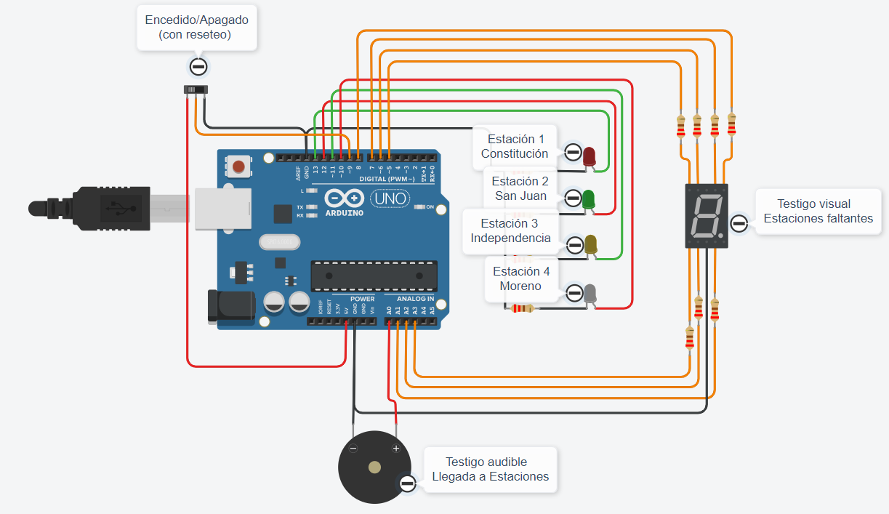

# Documentación

## Integrante 
- Esteban Juan Amén

## Proyecto: Detector presencia de SUBTE en estaciones.

## Descripción
Este proyecto, comprende lo dicho en el apartado anterior. Su función representa un sistema que detecta, mediante señalizaciones visuales y alrmas, la presencia de una formación "SUBTE" en las distintas estaciones ofrecidas en el mismo.

## Función principal
Como podemos ver más abajo, se definen los pines con "nobres" a utilizar a lo largo del código. En el apartado de "setup", configuramos los pines y en el "loop" generamos el codigo que va a inetractuar con la función principal (estacionesDeSubte), cuyo conjunto nos servirá para encender los led, el visualizador y el buzzer, interactuando con el encendido o apagado (con reset) por medio del interruptor.

~~~ C++ (lenguaje en el que esta escrito)
#define rojo 13
#define verde 12
#define amarillo 11
#define blanco 10
#define A 7
#define B 8
...(más codigo)
#define alarma A0
#define interruptor 9

void setup()
{
  pinMode(rojo, OUTPUT);
  pinMode(verde, OUTPUT);
  pinMode(amarillo, OUTPUT);
  pinMode(blanco, OUTPUT);
  pinMode(A, OUTPUT);
  pinMode(B, OUTPUT);
  ...(más codigo)
}

void loop()
{
  int valorEntrada = digitalRead(interruptor);
  Serial.println(valorEntrada);
  delay(1000);

  if(valorEntrada == 1){
     switch (contador)
  	{
      case 0:
          estacionesDeSubte(contador);
      case 1:
          estacionesDeSubte(contador);
      case 2:
          estacionesDeSubte(contador);
      case 3:
          estacionesDeSubte(contador);
  ...(más codigo)}

  void estacionesDeSubte(int numero) {
  switch(numero)
  {
  	case 0:
    	digitalWrite(A,HIGH);
    	digitalWrite(B,HIGH);
    	digitalWrite(C,HIGH);
    	digitalWrite(D,HIGH);
    	digitalWrite(E,HIGH);
    	digitalWrite(F,HIGH);
    	digitalWrite(G,LOW);
    	digitalWrite(rojo,LOW);
    	digitalWrite(verde,LOW);
    	digitalWrite(amarillo,LOW);
    	digitalWrite(blanco,HIGH);
    	tone(alarma, 220);
  		delay(50);
  		noTone(alarma);
    	break;
  ...(más codigo)}
~~~

## Link al proyecto
- [proyecto](https://www.tinkercad.com/things/9X4sj9bSeoa)
## Link al video del proceso
- [video](https://www.youtube.com/watch?v=VyGjE8kx-O0)

---
### Fuentes
- [Consejos para documentar](https://www.sohamkamani.com/how-to-write-good-documentation/#architecture-documentation).

- [Lenguaje Markdown](https://markdown.es/sintaxis-markdown/#linkauto).

- [Markdown Cheatsheet](https://github.com/adam-p/markdown-here/wiki/Markdown-Cheatsheet).

- [Tutorial](https://www.youtube.com/watch?v=oxaH9CFpeEE).

- [Emojis](https://gist.github.com/rxaviers/7360908).

---

